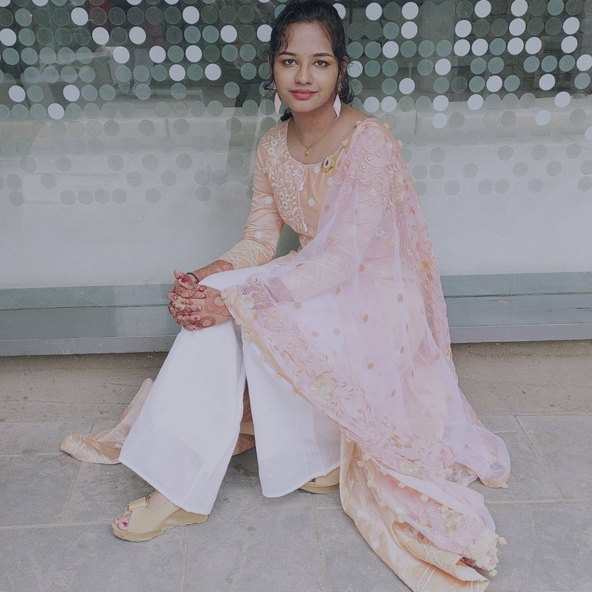

# Shreya Marda

***
My name is **Shreya Marda**.

I am from **Karnataka**.

I am studying in **Indian Institute of Technology, Goa**.

My hobbies are dancing, painting and sketching.

***
## Education

|**Year of Graduation**|**Degree**|**Institution**|
|:------:|:---------:|:------|
|2024|B. Tech| Indian Institute of Technology Goa|
|2021|12th standard or equivalent|Sri Chaitanya|
|2019|10th standard or equivalent|Shantiniketan Group of Institutions|

***

## 1st-year Courses @ IIT Goa

### Autumn semester

* **CS101**:Introduction to Computing by *Dr. Clint P. George* [CS101 link](https://clintpgeorge.github.io/cs-101/autumn-2021/)
* **PH101**:Physics(Relativity) by *Dr.Santoshkumar Das* and *Dr.Sudipta Kanungo*
* **MTH101**:Calculus by *Dr.Sandipan De*
* **MC100**:Introduction to Profession by *Dr. Abhitosh Upadhyay*
* **CH101**:Physical Chemistry by *Dr.E. Siva Subramanium*
* **CH102**:Organic and Inorganic Chemistry by *Dr. Rishikesh Narayan*
  
### Spring Semester

1. **CS102**: Software tools by Dr. Clint P George [CS102 link](https://clintpgeorge.github.io/cs-101/autumn-2021/)
2. **PH102**:Electricity and Magnetism by *Dr. Vaibhav Wasnik*
3. **MTH1021**:Linear Algebra by *Dr. Kalpesh Haria*
4. **ME102**:AUTOCad and Solid works by *Dr. Anirudha Ambekar*
5. **BIO101**:Biology by *Dr. Sreenath Balakrishnan*
6. **PH104**:Physics lab by *Dr. Sudipta Kanungo*
7. **EE101**:Introduction to Electrical circuits and circuit analysis by *Dr. Sheron Figarado* and *Nandakumar Nambath*
   
***
## Extracurricular activities

* I have many hobbies and even I like spending time with those hobbies like dancing, painting and sketching.
* I have also received many prizes in these hobbies.In painting competition in IIT Goa on the Republic day I got 2nd prize.
* I also participated in CultRang in the dance compeitions like ABCD, Tribhanga, ARtistry and Abstract.
* I have given the pictures of my drawings:
  

